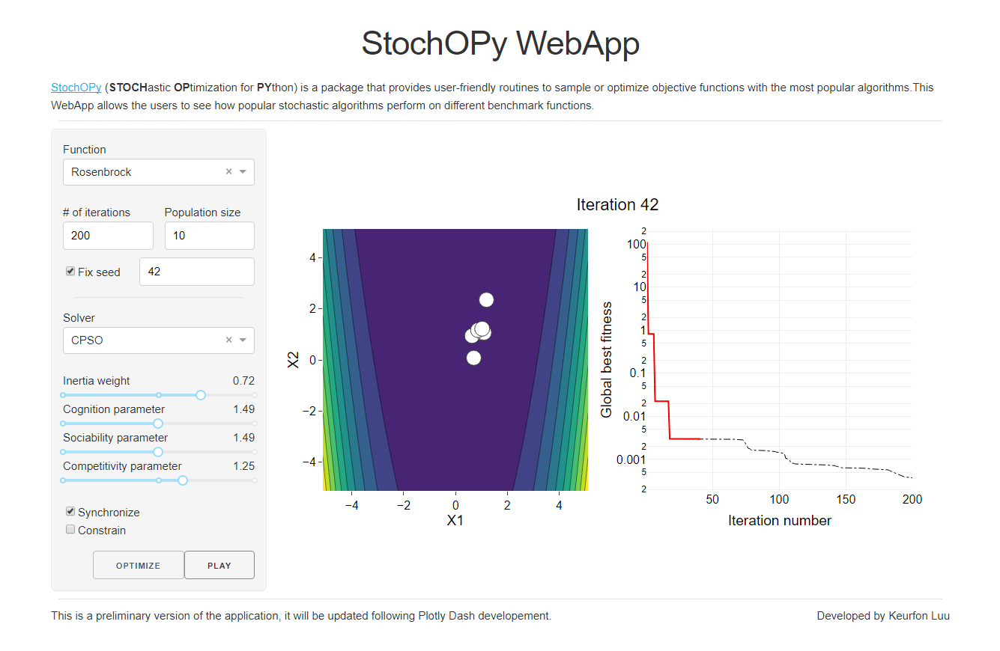

***************
StochOPy WebApp
***************

StochOPy WebApp allows the users to see how popular stochastic algorithms perform
on different benchmark functions.

:Version: 1.0.0
:Author: Keurfon Luu
:Web site: https://github.com/keurfonluu/stochopy-webapp
:Copyright: This document has been placed in the public domain.
:License: StochOPy WebApp is released under the MIT License.

**NOTE**: StochOPy WebApp has been implemented in the frame of my Ph. D. thesis.
If you find any error or bug, or if you have any suggestion, please don't hesitate
to contact me.

Related works
=============

* `StochOPy <https://github.com/keurfonluu/stochopy>`__: StochOPy (STOCHastic OPtimization for PYthon) provides user-friendly routines to sample or optimize objective functions with the most popular algorithms.
